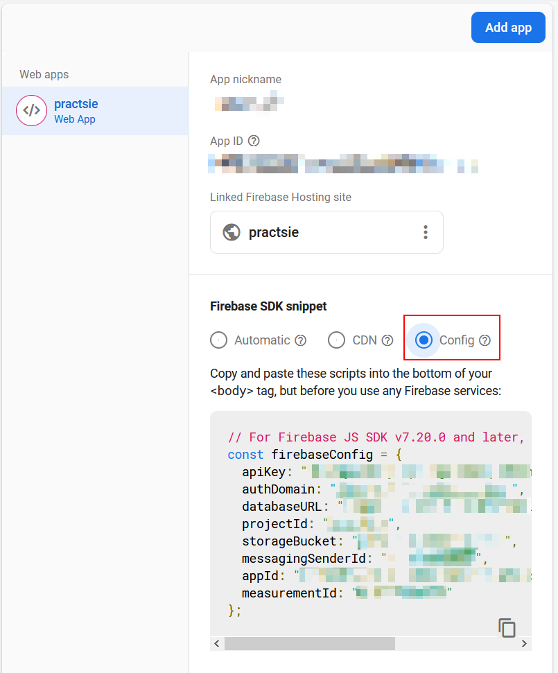

# Practsie

Simple surveys using Angular

## Using firebase

This applications makes use of firebase.
In order to access firebase, the firebase configuration needs to be provided to the application.
This is done via a configuration js object, similar to the one below:

```js
const firebaseConfig = {
  apiKey: "<blabla-key>",
  authDomain: "<blabla-domain>",
  databaseURL: "https://<blabla>.firebaseio.com",
  projectId: "<bla>",
  storageBucket: "<blabla>.appspot.com",
  messagingSenderId: "<blablaid>",
  appId: "<blablaotherid>",
  measurementId: "<blablablab>"
};
```

> Where can you find the configuration object?

Go to `Project Overview` ➡ `Project settings`.


Go to the General tab, Web apps and for you Web app, click the Config radio button.
You should see the Firebase SDK snippet.


> Where to store the configuration object?

In order not to store this in the repository, the configuration is stored in a source file added to the ignore list.
Please manually create the file `src/environments/firebase-data.ts` and paste the configuration object in there from the Firebase SDK snippet.
A quick way do work with the data is to copy the `src/environments/firebase-data-dummy.ts` file and edit it.

## Development server

Run `ng serve` for a dev server. Navigate to `http://localhost:4200/`. The app will automatically reload if you change any of the source files.

## Code scaffolding

Run `ng generate component component-name` to generate a new component. You can also use `ng generate directive|pipe|service|class|guard|interface|enum|module`.

## Build

Run `ng build` to build the project. The build artifacts will be stored in the `dist/` directory. Use the `--prod` flag for a production build.

## Running unit tests

Run `ng test` to execute the unit tests via [Karma](https://karma-runner.github.io).

## Running end-to-end tests

Run `ng e2e` to execute the end-to-end tests via [Protractor](http://www.protractortest.org/).

## Further help

To get more help on the Angular CLI use `ng help` or go check out the [Angular CLI README](https://github.com/angular/angular-cli/blob/master/README.md).
